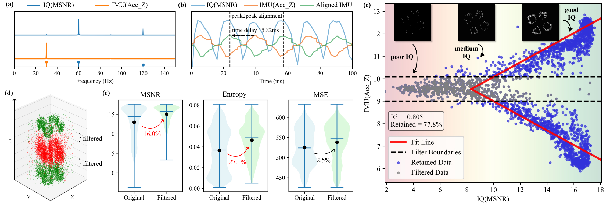

<a href="/publications" style="text-decoration: none;">
📄 Paper
</a>

<iframe src="https://www.youtube.com/embed/l238n79DOzo" width="640" height="360" allow="accelerometer; autoplay; clipboard-write; encrypted-media; gyroscope; picture-in-picture; web-share" allowfullscreen style="display: block; width: 100%; max-width: 640px; margin: 0 auto; border: none;"></iframe>

*Introduction Video*

This project addresses the fundamental challenges of robotic perception and locomotion in granular media environments. Traditional vision systems fail in opaque granular materials, making subsurface exploration extremely challenging for robotic systems.

*Integrating vibration to event-based perception*

Inspired by pioneering works like AMI-EV, Evetac, and ARCsnake, we systematically investigated the impact of 𝐚𝐜𝐭𝐢𝐯𝐞 𝐯𝐢𝐛𝐫𝐚𝐭𝐢𝐨𝐧 on event cameras, and integrated this insight into the head of a snake-like robot for visuotactile perception. Instead of treating vibration as noise, we engineered it into a dual advantage for both perception and actuation. The robot simultaneously enables 1000 Hz pixel-level tactile imaging and enhanced subsurface propulsion. 

*Active vibration induces fluctuations in event density, which can be estimated and filtered by the IMU signal*

Leveraging onboard IMU data, we further enhanced the perception ability with an model-based algorithm tailored to event stream sparsity and elastomer mechanics. Finally, we validated the system through extensive field experiments.

*Field experiment of the SandWorm robot, demonstrating its locomotion and perception abilities in granular materials*

