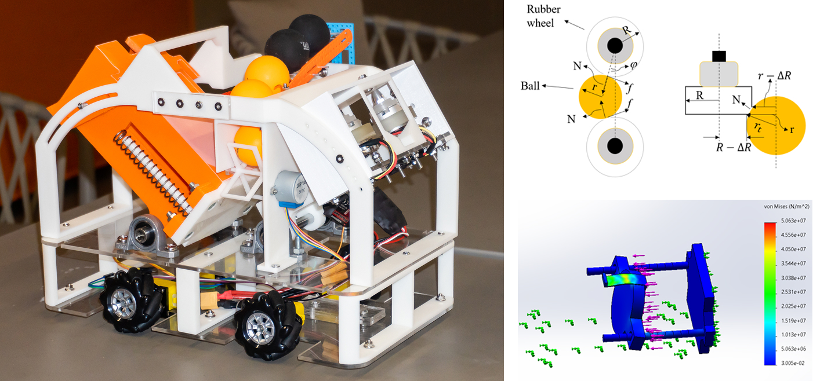
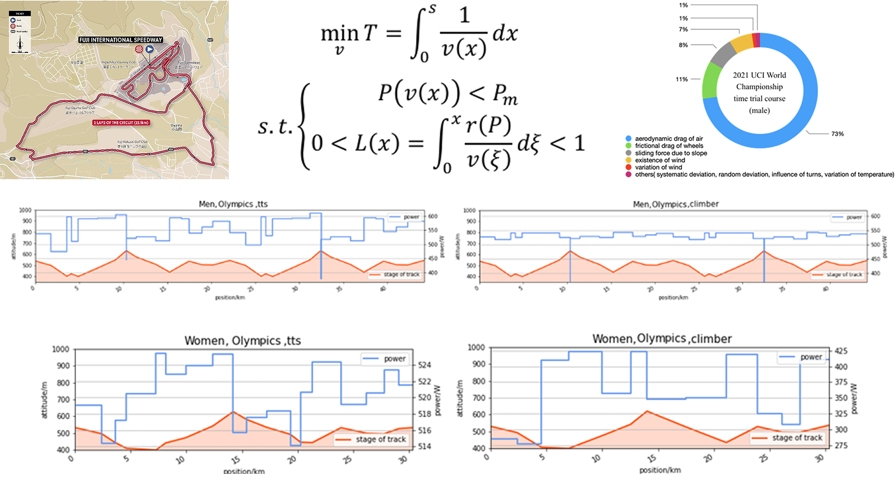
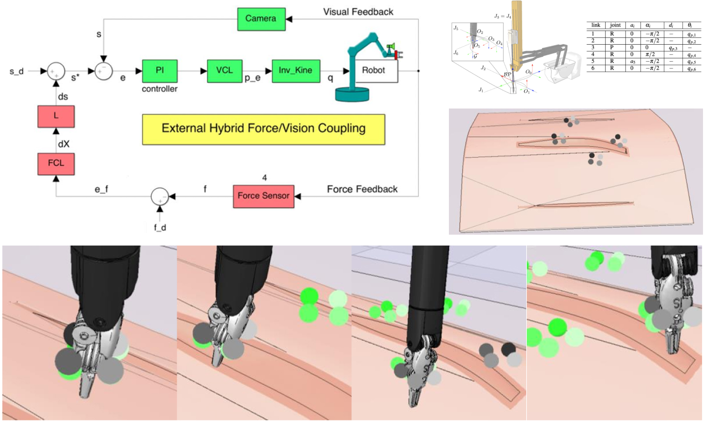
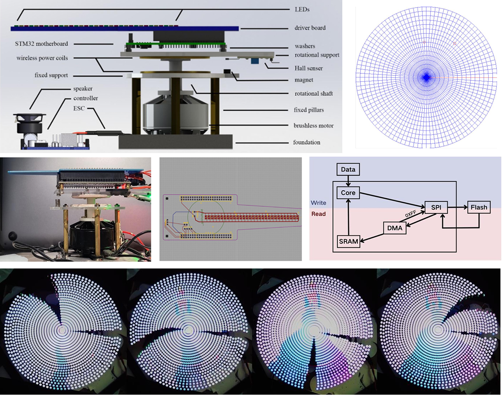

This section encompasses a diverse collection of undergraduate research projects that laid the foundation for advanced robotics and automation research.

### Telecontrolled Multi-Ball Launcher Platform

**Project Overview:** Engineered a modular, telecontrolled robotic platform capable of storing and launching three distinct types of projectiles. The system features an omnidirectional mobile base using Mecanum wheels for highly maneuverable positioning.

<strong>Technical Highlights:</strong>

<ul style="margin-top: 0.02em; margin-bottom: 0.5em; padding-left: 1.2em;">
  <li style="margin: 0.02em 0;"><strong>Dual Launch Mechanisms:</strong> Designed a dual-friction-wheel launcher for smaller balls (optimized via kinematic and dynamic modeling of friction and deformation) and a servo-triggered, spring-loaded launcher for tennis balls.</li>
  <li style="margin: 0.02em 0;"><strong>Simulation &amp; Validation:</strong> Conducted Finite Element Analysis (FEA) on critical load-bearing alloy steel components, ensuring operational stress remained well below yield strength.</li>
  <li style="margin: 0.02em 0;"><strong>Mechatronic Integration:</strong> Executed end-to-end development, from CAD modeling to the integration of real-time teleoperation and multi-actuator control systems.</li>
</ul>

**Core Skills:** CAD (SolidWorks), FEA, Mechatronics Integration, Kinematic/Dynamic Modeling, Omni-directional Motion Control.

### Optimal Power Distribution Model for Cycling Time Trials

**Project Overview:**
Developed a mathematical model to formulate the ideal pacing strategy for competitive cyclists, minimizing race completion time across complex, real-world terrains (e.g., Tokyo Olympic courses) based on individual physiological profiles.

<strong>Technical Highlights:</strong>

<ul style="margin-top: 0.02em; margin-bottom: 0.5em; padding-left: 1.2em;">
  <li style="margin: 0.02em 0;"><strong>Constrained Optimization Modeling:</strong> Formulated the race strategy as a nonlinear optimization problem. The objective function minimizes total time, which was mathematically constrained by the rider's instantaneous maximum power capacity and cumulative blood lactate accumulation thresholds.</li>
  <li style="margin: 0.02em 0;"><strong>Algorithmic Solver:</strong> Applied the Sequential Least Squares Programming (SLSQP) method to solve the dynamic power distribution. The algorithm successfully mapped optimal power outputs to track altitude variations (e.g., increased power allocation on uphills) and rider archetypes (climbers vs. time-trial specialists).</li>
  <li style="margin: 0.02em 0;"><strong>Sensitivity &amp; Robustness Analysis:</strong> Quantified environmental impacts (aerodynamic drag, wind direction/strength) and evaluated model stability by injecting random Gaussian noise and systematic deviations into the rider's execution plan, proving the strategy's robustness under real-world uncertainties.</li>
</ul>

**Core Skills:** Mathematical Modeling, Nonlinear Constrained Optimization (SLSQP), Sensitivity Analysis, Physical/Kinematic Simulation, Quantitative Data Analysis.

### Control and Modeling of da Vinci Medical Robot

**Project Overview:**
Developed a simulation and control model for the da Vinci Medical Robot, focusing on kinematics, force control, and visual servoing to ensure surgical accuracy.

<strong>Technical Highlights:</strong>

<ul style="margin-top: 0.02em; margin-bottom: 0.5em; padding-left: 1.2em;">
  <li style="margin: 0.02em 0;"><strong>External Hybrid Vision/Force Control:</strong> Integrated an image-based visual servo system with force sensor feedback. Designed a hierarchical architecture where the force control loop is closed around an internal vision control loop, modifying the reference trajectory to avoid conflicts between controllers.</li>
  <li style="margin: 0.02em 0;"><strong>Kinematic Modeling &amp; Optimization:</strong> Computed the inverse kinematics for the Patient Side Manipulator (PSM). Implemented a scaled Newton method utilizing the pseudo-inverse of the Jacobian, which prioritized certain joints and ensured rapid convergence. Using a Proportional-Integral (PI) controller and the pseudo-inverse of the interaction matrix, we eliminated steady-state error and reduced the time required for the end effector to converge to the target.</li>
  <li style="margin: 0.02em 0;"><strong>Simulation &amp; Validation:</strong> Validated the hybrid control scheme using MATLAB (Robotics System Toolbox) and V-REP software. The system successfully tracked smooth joint trajectories to targeted landmarks on a simulated tissue surface while maintaining the set contact force.</li>
</ul>

**Core Skills:** Kinematic Modeling, Image-Based Visual Servoing, Force Control, Control Theory (PI Controllers), Robotics Simulation (MATLAB, V-REP).

### POV-RGB Rotating Display System

**Project Overview:**
Engineered a Persistence of Vision (POV) RGB rotating display based on the STM32F407VET6 platform. The system integrates a dynamically balanced mechanical structure, wireless power transmission, and synchronized audio playback.

<strong>Technical Highlights:</strong>

<ul style="margin-top: 0.02em; margin-bottom: 0.5em; padding-left: 1.2em;">
  <li style="margin: 0.02em 0;"><strong>Hardware &amp; Structural Design:</strong> Designed the physical rotating assembly and a custom integrated RGB-expansion PCB. Implemented wireless power coils to ensure stable power delivery to the rotating module without physical wire constraints.</li>
  <li style="margin: 0.02em 0;"><strong>High-Speed Data &amp; Display Control:</strong> Leveraged Flash memory, SPI, and Direct Memory Access (DMA) for the rapid storage and retrieval of image data. Drove the RGB LED array by generating parallel synchronous PWM signals using hardware timers and DMA.</li>
  <li style="margin: 0.02em 0;"><strong>Algorithm &amp; Sensor Integration:</strong> Developed an optimized image rotation algorithm to map pixel data accurately and increase the LED refresh rate. Integrated a Hall effect sensor for precise starting point detection and frame synchronization.</li>
</ul>

**Core Skills:** Embedded Systems (STM32), PCB/Hardware Design, Firmware Development (DMA, SPI, PWM), Wireless Power Integration, Sensor Synchronization.
